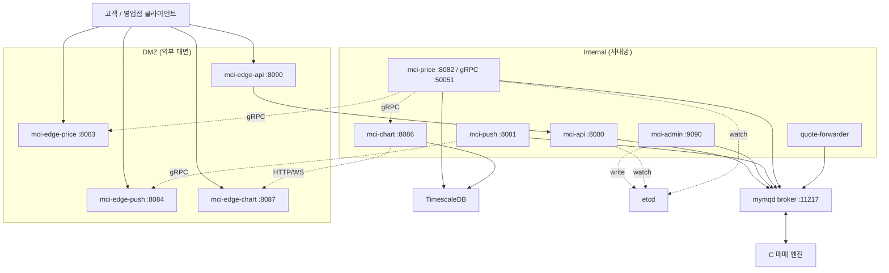
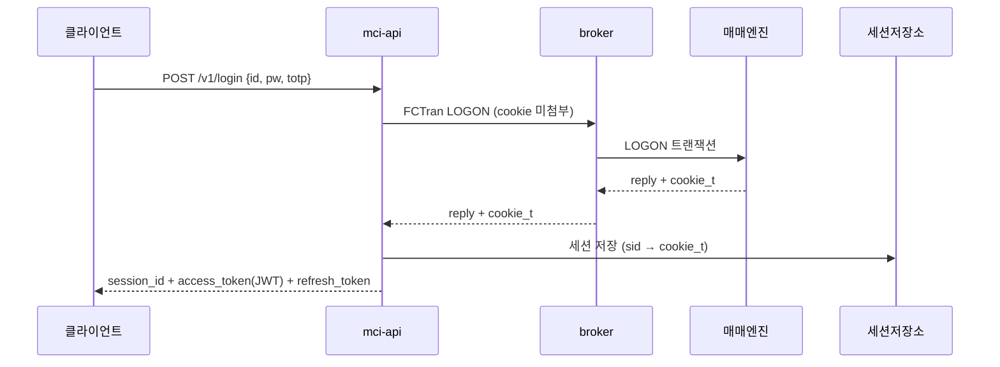
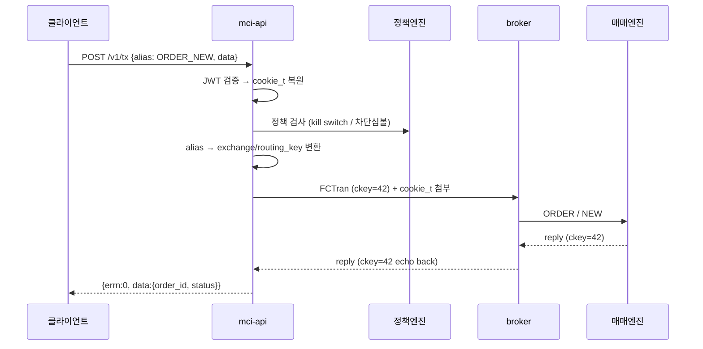
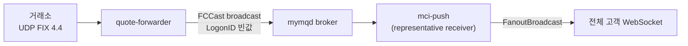
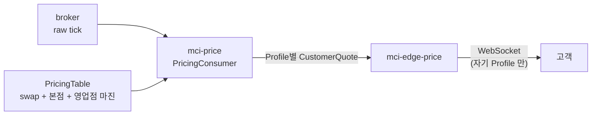
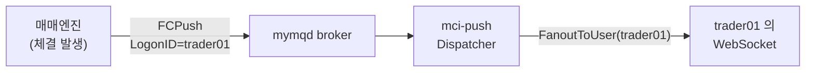
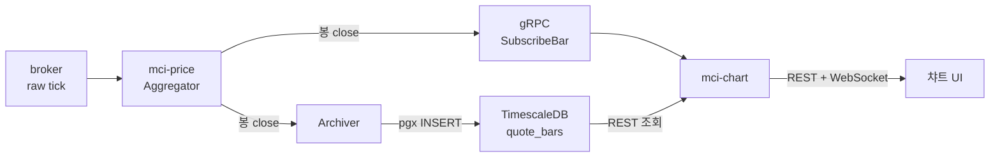
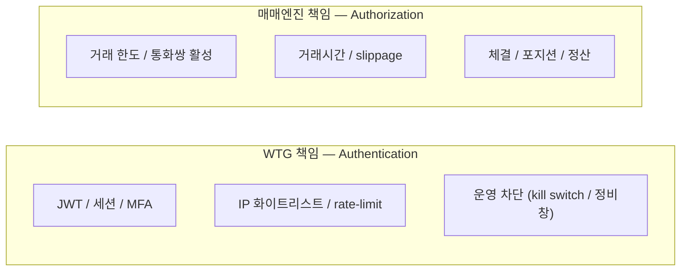

# WTG 거래별 전체 구조 — 흐름과 예시

> 작성일: 2026-05-24 · 대상: WTG (Winway Trading Gateway)
> WTG 가 처리하는 6가지 거래(트랜잭션)를 각각 예시와 다이어그램으로 설명한다.

---

## 1. 문서 개요

WTG 는 기존 C 기반 MyMQ 매매 엔진 앞단에 놓인 Go 게이트웨이다. 웹·모바일·CS·FIX 채널을 단일 broker(`mymqd`)로 정규화한다.

핵심 설계 원칙 다섯 가지를 먼저 기억하면 이 문서 전체가 쉽게 읽힌다.

1. **C 엔진 무수정** — broker 와 매매 AP 는 그대로 두고 WTG 는 mymq client 로만 붙는다.
2. **Go-native, no cgo** — wire protocol 을 순수 Go 로 재구현했다.
3. **단일 connection 멀티플렉싱** — `ckey`(correlation id)로 한 TCP 연결에서 동시 RPC 를 처리한다.
4. **DMZ ↔ Internal 분리** — 외부 트래픽은 `mci-edge-*`(DMZ)만 거치고 비밀(cookie_t·세션)은 Internal 에만 둔다.
5. **인증은 WTG, 권한은 엔진** — WTG 는 "누구인가"(Authentication)만, "무엇을 할 수 있나"(Authorization)는 매매 엔진이 판단한다.

다루는 6가지 거래: ① 로그인 ② 매매 주문 ③ 시세(raw) ④ 마진 적용 시세 ⑤ Push 알림 ⑥ 챠트.

---

## 2. 큰 그림 — 컴포넌트와 전송 수단



WTG 는 **4가지 전송 수단**을 용도에 맞게 쓴다.

| 전송 수단                 | 쓰이는 곳                                            | 특징                  |
| --------------------- | ------------------------------------------------ | ------------------- |
| MyMQ wire (broker 경유) | 트랜잭션, raw 시세, push, 마진시세 publish                 | 중앙 버스. `ckey` 멀티플렉싱 |
| gRPC                  | mci-price ↔ edge-price, mci-price ↔ chart        | WTG 내부 서비스 간 스트림    |
| PostgreSQL wire (pgx) | mci-price → TimescaleDB, mci-chart → TimescaleDB | 봉 영속·조회             |
| HTTP / WebSocket      | 클라이언트 ↔ WTG, admin UI                            | 외부 대면               |

`broker` 는 "중앙 우체국"으로 트랜잭션·시세·push 를 중개하고, WTG 내부 서비스끼리의 스트림은 gRPC, 시계열 저장은 TimescaleDB, 설정 공유는 etcd 가 담당한다.

---

## 3. 거래 ① 로그인 — `POST /v1/login`

사용자 본인 확인. 매매 엔진이 발급한 `cookie_t` 를 받아 세션에 보관하고, 이후 호출에 쓸 토큰을 내준다.



**흐름.** 로그인은 아직 세션이 없으므로 인증 미들웨어를 우회한다(`/v1/login` 은 public path). mci-api 는 `id/pw/totp` 를 해석하지 않고 그대로 LOGON 트랜잭션 body 에 실어 broker 로 보낸다(passthrough). 매매 엔진이 자격을 검증하고 `cookie_t` 를 발급하면, mci-api 가 그것을 `auth.Session` 으로 감싸 저장소(운영은 Redis 예정, 현재 in-memory)에 넣고 `session_id` 를 만든다. JWT Issuer 가 구성돼 있으면 RS256 `access_token`(15분)과 `refresh_token`(8시간)도 함께 발급한다.

**예시.**

```json
// 요청
POST /v1/login
{ "channel": "WEB", "data": { "id": "trader01", "pw": "••••••", "totp": "123456" } }

// 응답
{
  "session_id": "K3X...39자",
  "access_token": "eyJhbGciOiJSUzI1NiI...",
  "refresh_token": "QF7...52자",
  "expires_at": "2026-05-25T04:00:00Z",
  "channel": "WEB"
}
```

이후 모든 요청은 `Authorization: Bearer <access_token>` 을 달고 온다. 만료되면 `refresh_token` 으로 `/v1/refresh` 를 호출해 새 access token 을 받는다(single-use rotation).

---

## 4. 거래 ② 매매 주문 — `POST /v1/tx`

신규·취소·정정·조회 등 모든 매매 transaction. **transaction 별 핸들러를 만들지 않고** 단일 generic envelope 으로 broker 에 통과시킨다.



**흐름.** ① Auth 미들웨어가 JWT 를 검증하고 `claim.SID` 로 세션을 찾아 `cookie_t` 를 복원한다. ② JSON envelope 을 디코딩하고 transport 수준만 검증한다(비즈니스 검증은 엔진). ③ 정책 엔진이 운영 차단(kill switch·정비창·차단 심볼/routing-key)을 검사한다 — 비즈니스 거부가 아니라 운영 차단만. ④ `alias` 를 라우팅 룰 저장소에서 `exchange/routing_key` 로 치환한다. ⑤ `cookie_t` 를 프레임에 첨부하고 `MQ.Call` 로 보낸다 — 이때 `ckey` 가 자동 발급되어 단일 연결로 동시 호출이 가능하다. ⑥ broker 가 매매 엔진에 라우팅하고, 엔진의 reply 에 `ckey` 가 echo back 되어 정확히 매칭된다. ⑦ 엔진 응답(`errn`/`data`)을 그대로 클라이언트에 전달한다.

**예시.**

```json
// 요청 — alias 방식 (권장)
POST /v1/tx
{ "alias": "ORDER_NEW",
  "data": { "symbol": "USD/KRW", "side": "BUY", "qty": 100000, "price": 1372.50 } }

// mci-admin 라우팅 룰: ORDER_NEW → exchange=ORDER, routing_key=NEW

// 정상 응답
{ "errn": 0, "data": { "order_id": "ORD-20260524-0042", "status": "ACCEPTED" } }

// 비즈니스 거부 (엔진이 한도 초과 판단) — errn 그대로 전달
{ "errn": 1030, "errm": "거래 한도 초과", "data": null }

// 운영 차단 (WTG 정책엔진이 kill switch 로 차단) — 503
{ "error": "kill_switch", "message": "운영 정책으로 모든 거래가 일시 차단됨" }
```

핵심: WTG 는 주문 내용을 해석하지 않는다. 한도·시간·통화쌍 활성 같은 판단은 엔진의 `errn` 으로 받아 그대로 넘긴다. WTG 가 막는 것은 운영 차단(kill switch 등)뿐이다.

---

## 5. 거래 ③ 시세 (raw) — UDP FIX → broadcast

거래소 시세를 가공 없이 전체 고객에게 실시간 배포한다.



**흐름.** `quote-forwarder` 가 UDP 로 FIX 4.4 메시지(`35=W` 스냅샷 / `35=X` 증분)를 받아 `tag=value` 를 파싱하고, `{ts, feed, symbol, entries[]}` JSON envelope 으로 바꾼다. 80바이트 broadcast prefix 의 `LogonID` 를 **빈값**으로 둔 채 `FCCast` 로 broker 에 publish 한다. `mci-push` 는 broker 에 representative receiver 로 등록돼 모든 publish 를 받고, `LogonID` 가 비어 있으므로 `FanoutBroadcast` 로 등록된 모든 ws 연결에 뿌린다.

**예시.**

```
// UDP FIX (SOH 를 | 로 표기)
8=FIX.4.4|35=W|55=USD/KRW|269=0|270=1372.40|271=1000000|269=1|270=1372.60|271=1000000|
```

```json
// quote-forwarder 가 만든 envelope → 그대로 ws 까지 전달
{ "ts": "2026-05-24T04:30:01.123Z", "feed": "SMB", "seq": 8842,
  "msgtype": "snapshot", "symbol": "USD/KRW",
  "entries": [ { "type": "bid", "px": 1372.40, "qty": 1000000 },
               { "type": "ask", "px": 1372.60, "qty": 1000000 } ] }
```

이 시세는 **raw**(마진 미적용)이며 전체 공통이다. 고객 등급별로 다른 가격은 다음 거래 ④ 가 담당한다.

---

## 6. 거래 ④ 마진 적용 시세 — Profile별 fan-out

raw 시세에 마진/스왑을 적용해, 고객 등급(Profile)별로 다른 가격을 만들어 배포한다. **마진 계산을 한 곳(mci-price)에서만** 수행해 client·엔진 간 로직 이중화를 없애는 것이 목적이다.



**흐름.** `mci-price` 가 broker 에서 raw tick 을 받아 `PricingConsumer.OnTick` 으로 처리한다. 심볼을 `SymbolMap` 에서 통화쌍으로 매핑하고, **활성 Profile 목록**을 순회하며 각 Profile 에 대해 `PricingTable.Apply` 를 호출한다. `PricingTable` 은 세 가지 마진 — 스왑포인트(Pair·만기), 본점 마진(Pair·등급), 영업점/채널 마진(Pair·채널·Site) — 를 담고 있고, 산식은 `bid = raw − (swap+hq+site)`, `ask = raw + (swap+hq+site)` 다. 결과 `CustomerQuote` 를 broker `ExchangeQuote`(routing-key = `Profile.Key()`)와 gRPC `SubscribeQuote` 양쪽으로 publish 한다. `mci-edge-price` 는 로그인한 고객의 Profile 스트림만 구독해 그 고객에게 내려준다.

**예시.** raw `USD/KRW` bid 1372.40 / ask 1372.60 에 대해:

| Profile | 적용 마진 (bid/ask 합) | 고객이 보는 시세 |
|---|---|---|
| `WEB.BRANCH.VIP` | 0.15 / 0.15 | 1372.25 / 1372.75 |
| `WEB.BRANCH.STD` | 0.40 / 0.40 | 1372.00 / 1373.00 |

```json
// CustomerQuote wire (customerQuoteDTO) — WEB.BRANCH.VIP
{ "pair": "USD/KRW", "chan": "WEB", "site": "BRANCH", "tier": "VIP",
  "tenor": "SPOT", "bid": 1372.25, "ask": 1372.75,
  "raw_bid": 1372.40, "raw_ask": 1372.60, "v": 17 }
```

`v`(TableVersion)와 raw 값을 함께 보존해, 나중에 "이 가격이 어느 마진 테이블 버전에서 나왔는지" 재현·감사할 수 있다. 마진 테이블은 `mci-admin` 의 "마진 테이블" 화면에서 편집 → etcd `wtg/pricing/table` 저장 → 모든 `mci-price` 가 watch 로 즉시 반영한다.

---

## 7. 거래 ⑤ Push 알림 — 체결·주문상태

매매 엔진이 능동적으로 보내는 비요청(unsolicited) 메시지를 특정 사용자에게 전달한다.



**흐름.** 시세(거래 ③)와 같은 mci-push 경로를 쓰지만 방향이 "특정 사용자 타깃"이다. 매매 엔진이 체결·주문상태·리스크 알림을 broker 에 `FCPush` 로 publish 하면서 broadcast prefix 의 `LogonID` 에 대상 사용자를 채운다. `mci-push` 의 Dispatcher 는 `LogonID` 가 채워져 있으므로 `FanoutToUser(usid)` 로 그 사용자의 ws 연결에만 보낸다. 같은 사용자가 여러 단말로 접속해 있으면 모두에게 전달된다.

**예시.**

```json
// trader01 의 ws 로 도착하는 체결 통보
{ "func": 13, "subc": 54, "exchange": "EXEC", "logon_id": "trader01",
  "data": { "event": "fill", "order_id": "ORD-20260524-0042",
            "symbol": "USD/KRW", "filled_qty": 100000, "fill_price": 1372.50,
            "status": "FILLED" } }
```

거래 ③ raw 시세는 `LogonID` 빈값 → `FanoutBroadcast`(전체), 거래 ⑤ Push 는 `LogonID` 채움 → `FanoutToUser`(특정인). **이 한 필드가 broadcast 와 user-targeted 를 가른다.**

---

## 8. 거래 ⑥ 챠트 — OHLC 봉

시세 tick 을 봉(캔들)으로 가공해 historical 조회와 라이브 봉을 제공한다.



**흐름.** `mci-price` 의 `Aggregator` 가 tick 을 6개 timeframe(1s/1m/5m/15m/1h/1d)의 OHLC 봉으로 누적한다. 봉이 닫히면 두 갈래로 fan-out 한다 — `Archiver` 가 `pgx` 로 TimescaleDB `quote_bars` 에 INSERT(1분 이상만 영속, 1초 봉은 메모리만), 동시에 gRPC `SubscribeBar` 스트림으로 `mci-chart` 에 보낸다. `mci-chart` 는 REST `GET /v1/chart` 로 historical 봉(TimescaleDB 조회)을, WS `/v1/chart/stream` 으로 라이브 봉을 제공한다.

**예시.**

```json
// quote_bars 의 1분 봉 한 행
{ "pair": "USD/KRW", "tf": "1m",
  "opened_at": "2026-05-24T04:30:00Z", "closed_at": "2026-05-24T04:31:00Z",
  "open_bid": 1372.40, "high_bid": 1372.55, "low_bid": 1372.30, "close_bid": 1372.48,
  "open_ask": 1372.60, "high_ask": 1372.75, "low_ask": 1372.50, "close_ask": 1372.68,
  "tick_count": 184 }
```

```
// historical 조회
GET http://mci-chart:8086/v1/chart?pair=USD/KRW&tf=1m&from=2026-05-24T00:00:00Z&to=2026-05-24T06:00:00Z
```

**중요 — broker 관여 범위.** 챠트 파이프라인에서 broker 는 *입구*(raw tick 을 mci-price 로 넣어주는 구간)에만 관여한다. 봉 생성·gRPC·TimescaleDB·REST/WS 는 broker 를 거치지 않는다. 그래서 broker 가 죽어도 DB 에 쌓인 historical 봉 조회는 계속되지만, 새 tick 공급이 끊겨 라이브 봉은 멈춘다.

---

## 9. 횡단 관심사 (cross-cutting)

### 9.1 인증 / 권한 분담



WTG 는 "누구인가"와 "운영상 지금 거래를 받을 상태인가"까지만 본다. "이 사람이 이 거래를 할 수 있는가"는 엔진이 판단하고, WTG 는 엔진의 `errn` 을 그대로 전달한다.

### 9.2 etcd hot reload

라우팅 룰·정책·시세 카탈로그(symbols/pricing/profiles)는 etcd 에 저장된다. `mci-admin` 이 write 하면 etcd 의 watch 가 모든 `mci-api`·`mci-price` 인스턴스에 즉시 알려 메모리 사본을 갱신한다 — **재배포 없이 즉시 반영**된다.

### 9.3 broker 관여 범위 한눈에

| 거래 | broker 관여 |
|---|---|
| ① 로그인 | 전 구간 (LOGON 트랜잭션) |
| ② 매매 주문 | 전 구간 (요청·응답 라우팅) |
| ③ raw 시세 | 전 구간 (forwarder → broker → mci-push) |
| ④ 마진 시세 | raw tick 수신 + 마진시세 publish |
| ⑤ Push 알림 | 전 구간 (엔진 → broker → mci-push) |
| ⑥ 챠트 | 입구만 (raw tick → mci-price). 이후 gRPC·DB |

### 9.4 확장 검토 중 — 매칭 엔진 마진 피드

마진 계산을 mci-price 한 곳으로 모으면, 매칭 엔진도 동일한 마진가를 실시간으로 받아야 client·엔진 간 가격 불일치가 사라진다. `mci-price` 의 `MultiQuotePublisher` 구조가 이미 다중 fan-out 을 지원하므로, 매칭 엔진을 `ExchangeQuote` 구독자로 추가하면 기술적으로 가능하다. 남은 결정 사항은 (a) Profile 키잉 방식 — 엔진이 전 Profile 스트림을 들고 있을지 vs 주문이 quote 토큰을 들고 올지, (b) quote staleness 시 체결가 정책(엔진 책임), (c) mci-price 의 HA 와 의존성 역전 대응이다.

---

## 10. 부록 — 서비스 / 포트 카탈로그

| 서비스 | 포트 | 위치 | 역할 |
|---|---|---|---|
| `mci-edge-api` | 8090 | DMZ | TLS 종단 + JWT 검증 → mci-api 프록시 |
| `mci-edge-price` | 8083 | DMZ | 마진 시세 ws fan-out |
| `mci-edge-push` | 8084 | DMZ | push ws fan-out |
| `mci-edge-chart` | 8087 | DMZ | 챠트 reverse-proxy |
| `mci-api` | 8080 | Internal | `/v1/tx` `/v1/login` `/v1/refresh` |
| `mci-admin` | 9090 | Internal | 운영 콘솔 + 라우팅/정책/마진 CRUD |
| `mci-push` | 8081 | Internal | broker unsolicited → ws fan-out |
| `mci-price` | 8082 / 50051 | Internal | 시세 conflation + 마진 적용 + 봉 생성 |
| `mci-chart` | 8086 | Internal | TimescaleDB 봉 REST + 라이브 봉 WS |
| `quote-forwarder` | UDP 30044~30051 | Internal | UDP FIX → broker broadcast |
| `mymqd` (broker) | 11217 | — | 중앙 메시지 버스 |
| `TimescaleDB` | 5432 | — | `quote_bars` 시계열 저장소 |
| `etcd` | 2379 | — | 라우팅·정책·시세 카탈로그 공유 |

---

*이 문서는 2026-05-24 시점의 WTG 소스 정독을 기반으로 작성되었다. 코드가 빠르게 변경 중이므로 세부 동작은 해당 시점의 소스를 기준으로 한다.*
